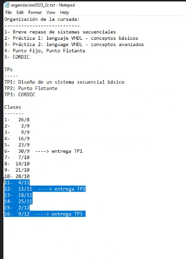
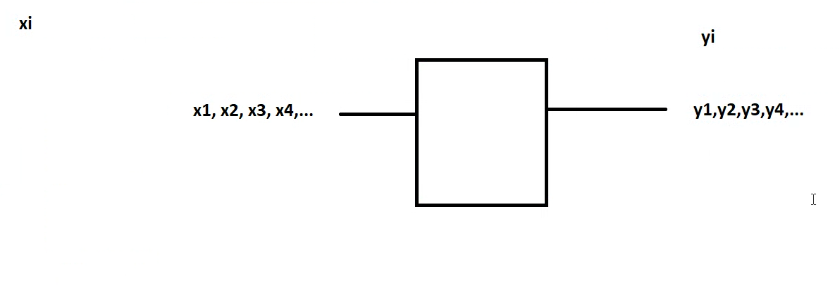
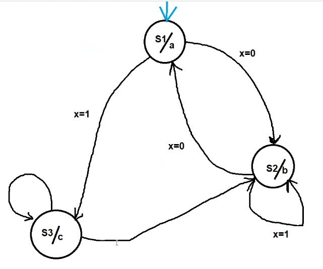
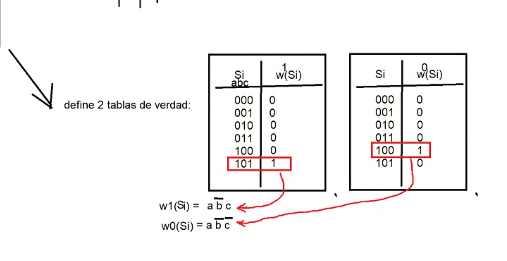
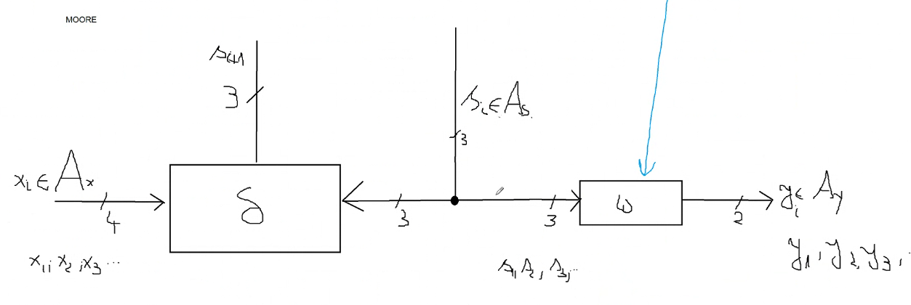
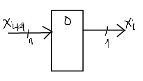
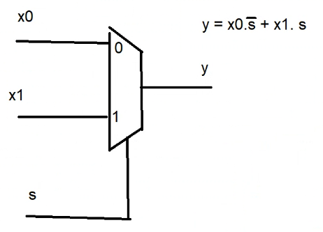
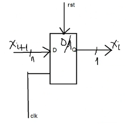
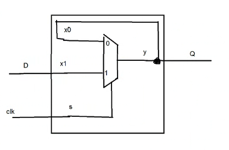

# Clase 1: 26 de Agosto

## Conceptos Introductorios

- **Circuito secuencial**: Un circuito que toma una entrada indexada.
- **Indexada**: Se refiere a una ordenación por los números naturales.
- **Xi**: Representa un alfabeto finito que puede tomar solo `n` símbolos.

## Implementación

Existen dos métodos para implementar en la práctica: 

- **Síncronica**: Es la que se estudiará en esta materia.
- **Asincrónica**: No se utiliza en la industria.

El circuito secuencial más básico es la **Máquina de estado finito (FSM)**. La cantidad de estados en una FSM es finita y se pueden enumerar como un tercer alfabeto, denominado "el estado de la máquina", por ejemplo: S0, S1, etc.

### Máquina de estado

Una máquina de estado tiene:

- Xi ∈ N
- Yi ∈ N
- Si ∈ N
- xi ∈ Ax (Donde A es un alfabeto)
- yi ∈ Ay
- si ∈ As

**Función de transición**:

δ : Ax x As → As

Ejemplo: δ(X1, S3) -> S5

Existen dos definiciones principales de máquina de estado:

1. **Mealy**: ω : As x Ax → Ay
2. **Moore**: ω : As → Ay (Es la que generalmente se utilizará)

Ambas definiciones representan **funciones de traducción**.

Ejemplo:

ω(s4) = Υ3

Si existe una máquina de Moore que implementa una máquina de estado, entonces existe una de Mealy. Pero desde el punto de vista eléctrico, Moore tiene ventajas que se prefieren.

### Definición Formal

La definición formal de una máquina de estado es una 6-tupla: 

(Ax, Ay, As, δ, ω, s0)

Esto define completamente una máquina de estado que puede ser implementada como máquina de Moore. Usualmente, esto se representa a través de un grafo.

## Aplicaciones

¿Qué tipo de problemas podemos resolver con una máquina de estado? 

Un libro podría mencionar el análisis (parsing) de expresiones regulares. Esencialmente, una máquina de estado puede reconocer símbolos de una secuencia finita de estados.

Ejemplo: e=Χ7,Χ9\*, Χ10 

### Tipos de FSM

1. **Aceptador**: Su alfabeto de salida es {0, 1} o {a, r}.
2. **Traductor**: Su alfabeto de salida tiene más de 2 símbolos.

Definir una máquina de estado se suele reducir a definir δ y ω.

Ejemplo:

| Si | ω(Si) |
|---------------|------------------|
| S0   | 0   |
| S1   | 0   |
| S2   | 0   |
| S3   | 0   |
| S4   | 1   |
| S5   | 2   |

| Xi | Si | δ(Xi,Si) |
|---------------|-----------------|--------------------------------|
| X1   | S0  | S0 |
| X2   | S0  | S0 |
| X3   | S0  | S0 |
| X4   | S0  | S0 |
| X5   | S0  | S2 | 
| X6   | S0  | S0 |
| X7   | S0  | S1 |
| etc   | etc  | etc |

En circuitos digitales vamos a codificar en binario

| Si | Valor |
|--------|-------|
| S0 | 000 |
| S1 | 001 |
| S2 | 010 |
| S3 | 011 |
| S4 | 100 |
| S5 | 101 |
| S6 | 110 |
| S7 | 111 |

| Xi     | Valor |
|------------|-------|
| X0   | 0000 |
| X1   | 0001 |
| X2   | 0010 |
| X3   | 0011 |
| X4   | 0100 |
| X5   | 0101 |
| X6   | 0110 |
| X7   | 0111 |
| X8   | 1000 |
| X9   | 1001 |
| X10  | 1010 |
| ...       | ...   |
| X15  | 1111 |

| Yi | Valor |
|--------|-------|
| Y0 | 00 |
| Y1 | 01 |
| Y2 | 10 |
| Y3 | 11 |

| Si | (Si) |
|--------|-------|
| 000 | 00 |
| 001 | 00 |
| 010 | 00 |
| 011 | 00 |
| 100 | 01 |
| 101 | 10 |

Esto define 2 tablas de verdad:

## Registros

### Definición Informal de Registro
Un registro se puede definir, de manera informal, como la Máquina de Estado Finito (FSM) más pequeña posible. Cuando decimos "más pequeña", nos referimos a las siguientes características:

- **Ax** = {0,1}
- **Ay** = {0,1}
- **As** = {0,1}
  
El estado inicial **S0** puede tener el valor 0 (representado como "rst") o el valor 1 (representado como "set").

Tanto δ como ω tienen la función identidad.

### Función Identidad para δ

- δ(0,Si) = 0
- δ(1,Si) = 1

### Función Identidad para ω

Para una FSM tipo **Moore**:

- ω(0) = 0
- ω(1) = 1

Para una FSM tipo **Mealy**, se debe agregar la entrada **Xi**.

¿Cómo se implementa esto en la práctica?

Tomemos un multiplexor de 1 línea de selección

- y = x0*not s +x1*s
- Qi+1 = Di*clk+Qi*not clk

Todas las líneas son de 1 bit